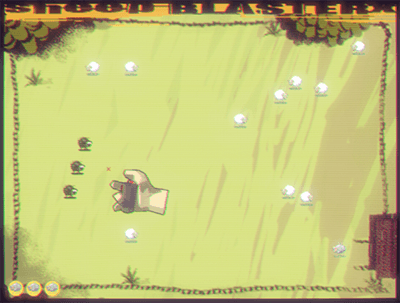

# Sheep Blaster X

 

_Version 1.0 (2001-05-20)_

Presented at the FarWest 3 compo for the 100kB "foot-and-mouth disease" Game compo (May 11-12-13, 2001, France).

## Credits

- Graphs: Danube (sheep sprites, background)
- Graphs: Fra (title, gameover, hands)
- Music: None
- Code: Mars

## Commands

- Left mouse button to launch a cybersheep-bomb-x-alpha-6.81-with-neutrons
- Left mouse button to give the cybersheep a target
- Right mouse button to make it explode
- The cybersheep will explode after 10 seconds, or if it touches another sheep
- Press ESC to quit at any time

## Release Notes

- **Requirements:** Windows 9x/2K OS with a bit of memory and a 3D accelerated GFX card with OpenGL support
- **Final Version:** The file provided with this README is the final version, which replaces the not-so-great party version
- **Objective:** As usual, this game is just silly... Just burn those sheep with foot-and-mouth disease!

---

We hope you'll like it!

```
                                                            
                                                            
             ,%@@@@#*                   .@,   .,            
        &@@@@@@@@@@@@@@@@&              /(*@@@@@@#     .    
     *@@@@@@@@@@@@@@@@@@@@@@@@       *&@@@@@@@@@..&@.       
   @@@@@@@%@@@@@@@@@@@@@@@@@@@@@@@@@@@@@@@@@@@@ @@@ .@/     
 .@,   @@@@@,@@@,   #@@@@@%.             %@#@@@@/@@@@& @&   
                  @@@@@*                  @@&@@@@  @@@&@@@  
                .@@@@#                    /@@@&@@ @.*@@@@@@ 
                @@@@*           %@@@@@@,   (@@@@. %/* @@@@% 
               @@@@%         @%     @@@@@@@            @@@  
               @@@@       .@           @@@@@(         @@    
               @@@@       @/ @@@@,       &@@&               
               /@@@        #@@@@@         @@                
                @@@%                     @@.                
                 &@@@.                /@@@                  
                   @@@@@@@@@@@@&&@@@@@@@(                   
                     ,@@@@@@@@@@@@@@@@&                     
                             ***/,                          
                                                            
                                                            
```
